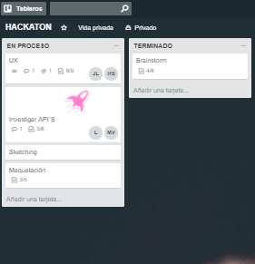

# Gify Cinema


## Propuesta
Proyecto de crítica de cine usando api GIPHY y OMDB para la busqueda de películas git 
Crear un sitio web donde los hispanohablantes puedan compartir reseñas de peliculas sin pretensiones, de manera intuitiva y amigable.

#### Pain Points

* Muchos espectadores disfrutan de películas no universalmente elogiadas por la crítica, por lo que no ponen mucho énfasis en las calificaciones.

* Los sitios web orientados a nichos tienen información más detallada sobre películas y programas de televisión de un cierto género.

* La mayoría de los espectadores no siguen ningún crítico en particular y muchos rara vez leen reseñas en profundidad, si es que lo hacen.


#### Encuestas

* 45% ver reseñas o puntuaciones de la mayoría o de todas las películas que ven

* El 23% comprende con confianza el sistema de calificación Tomatometer

* El 23% consideró que las evaluaciones o calificaciones son importantes o muy importantes a la hora de decidir qué mirar


## Proceso creativo y organización

#### Brainstorming:
* Definimos el area de entretenimiento a explorar.
* Detectamos la necesidad de un sitio para criticas cinematograficas en donde no haya reseñas _pretensiosas_.  
* Diferenciador: Experiencia intuitiva. Ya que muchos sitios web de la competencia poseen herramientas con un grado de complejidad no apto para usuarios nuevos, con lo cual se tornan inconvenientes e incluso estorbosas


#### Planeación.

#### Trello



#### Agenda por día.
| Integrante | Martes | Miercoles | Jueves | Viernes
| ---------- | ------ | --------- | ------ | -------
| Jazmin | Brainstorming, planificación del trabajo, Ideación del proyecto, UX basics,logo y paleta de colores, git branch | Vistas | Vistas | Detalles
| Laura | Brainstorming, planificación del trabajo, Ideación del proyecto, UX basics, estructura html, APIs research, git master | Api OMDV (pelis) | Implementar API y funcionalidades | Practicas presentaciÓn
| Tony | Brainstorming, planificación del trabajo, Ideación del proyecto, UX basics, APIs research, git branch  | API OMDV (pelis)| Implementar API y funcionalidades | Practicas Presentación
| Scarlett | Brainstorming, planificación del trabajo, Ideación del proyecto, UX basics,APIS research, | Git branch, READme, recabación de información, estrategia basada en descubrimiento | Presentación | Practicas presentación.


***

#### Pre-requisitos

Requiere explorador web
```
Chrome, Safari, Internet explorer...
```
***

## < l a b o r a t o r i a >
